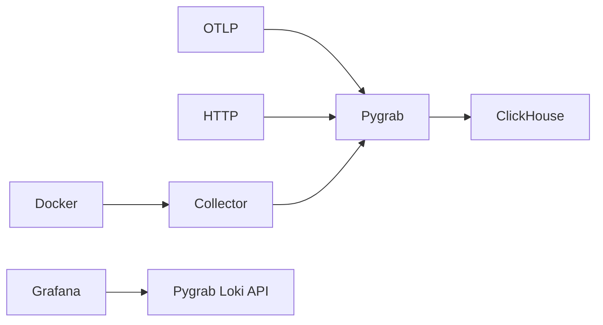

# pygrab

Lightweight observability backend for logs and distributed traces.

Pygrab collects logs from Docker containers, receives OpenTelemetry traces, stores observability data in ClickHouse, and exposes a Loki-compatible API for seamless Grafana integration.

## Features

- **Log ingestion**
  - HTTP JSON log ingestion API
  - Loki-compatible push endpoint
  - Native Docker container log collection

- **Grafana integration**
  - Loki-compatible query API
  - LogQL selector support
  - Grafana Explore compatibility
  - Real-time log streaming via WebSocket

- **Distributed tracing**
  - OpenTelemetry (OTLP) trace ingestion
  - Span correlation
  - Trace storage in ClickHouse

- **Docker collector**
  - Streams stdout/stderr from containers
  - Dynamic container attachment
  - Automatic metadata enrichment

- **High-performance storage**
  - ClickHouse analytical storage
  - Async ingestion pipeline
  - Buffered log processing

---

# Architecture



---

# Project Structure

```
pygrab/
├── app/
│   ├── api/
│   │   ├── dependencies.py
│   │   └── v1/
│   │       ├── injest.py
│   │       ├── loki.py
│   │       └── traces.py
│   ├── application/
│   │   ├── collector/
│   │   │   ├── labels.py
│   │   │   ├── parser.py
│   │   │   └── worker.py
│   │   ├── dto/
│   │   │   └── logs.py
│   │   ├── interfaces.py
│   │   ├── logs/
│   │   │   ├── buffer.py
│   │   │   ├── service.py
│   │   │   └── worker.py
│   │   ├── query/
│   │   │   ├── parser.py
│   │   │   └── service.py
│   │   ├── schemas/
│   │   │   └── otlp.py
│   │   ├── traces/
│   │   │   ├── converter.py
│   │   │   └── service.py
│   │   └── utils/
│   │       ├── loki_helpers.py
│   │       ├── time_parser.py
│   │       └── tui_formatter.py
│   ├── core/
│   │   ├── config.py
│   │   ├── dependencies.py
│   │   └── exceptions.py
│   ├── domain/
│   │   ├── enums.py
│   │   └── models.py
│   ├── infrastructure/
│   │   └── clickhouse/
│   │       ├── client.py
│   │       ├── factory.py
│   │       ├── pool.py
│   │       └── repos/
│   │           ├── logs.py
│   │           └── traces.py
│   └── main.py
├── migrations/
├── tests/
│   ├── conftest.py
│   ├── test_collector.py
│   ├── test_ingest.py
│   ├── test_logql_parser.py
│   ├── test_loki_push.py
│   └── test_query.py
├── docker-compose.yml
├── Dockerfile
├── pyproject.toml
└── README.md
```

---

# Quick Start

## 1. Start infrastructure

Make sure Docker is running.

Start Pygrab, ClickHouse and Grafana:

```bash
docker compose up --build -d
```

Services:

| Service | Address |
|---|---|
| Pygrab API | http://localhost:8000 |
| Grafana | http://localhost:3000 |
| ClickHouse | http://localhost:8123 |

---

# Grafana Setup

Pygrab exposes a Loki-compatible API.

Add a Loki datasource in Grafana:

```
URL:

http://pygrab:8000
```

Example query:

```logql
{container_name="pygrab_api"}
```

You can now explore logs directly from Grafana.

---

# Configuration

Copy environment example:

```bash
cp .env.example .env
```

Example:

```env
LOG_LEVEL=info

LISTEN_HOST=0.0.0.0
LISTEN_PORT=8000

CLICKHOUSE_DB=pygrab_db
CLICKHOUSE_USER=pygrab_user
CLICKHOUSE_PASSWORD=password
CLICKHOUSE_HOST=localhost
CLICKHOUSE_PORT=8123
```

Docker collector configuration:

```env
DOCKER_ENABLED=True
DOCKER_SOCKET=unix:///var/run/docker.sock

DOCKER_CONTAINERS='[
  {
    "name": "fastapi-app",
    "service": "backend",
    "environment": "production"
  }
]'
```

---

# Docker Collector Metadata

When Docker collection is enabled, Pygrab enriches every log entry with metadata labels.

| Label | Description |
|---|---|
| service | Service name from configuration |
| environment | Deployment environment |
| container_name | Docker container name |
| container_id | Container identifier |
| stream | stdout/stderr source |

Example:

```logql
{service="backend", environment="production"}
```

---

# API Reference

## Loki API

### Query logs

```http
GET /loki/api/v1/query
```

Example:

```bash
curl \
"http://localhost:8000/loki/api/v1/query?query={container_name=\"pygrab_api\"}"
```

---

### Range query

```http
GET /loki/api/v1/query_range
```

Example:

```bash
curl \
"http://localhost:8000/loki/api/v1/query_range?query={service=\"backend\"}"
```

---

### Push logs

Loki-compatible ingestion:

```http
POST /loki/api/v1/push
```

Example:

```bash
curl -X POST http://localhost:8000/loki/api/v1/push \
-H "Content-Type: application/json" \
-d '
{
  "streams": [
    {
      "stream": {
        "service": "api"
      },
      "values": [
        [
          "1719830400000000000",
          "Server started"
        ]
      ]
    }
  ]
}'
```

---

### Labels

List available labels:

```http
GET /loki/api/v1/labels
```

Example:

```bash
curl http://localhost:8000/loki/api/v1/labels
```

Get label values:

```http
GET /loki/api/v1/label/{name}/values
```

---

### Live tail

Real-time log streaming:

```
WS /loki/api/v1/tail
```

Compatible with Grafana Live Tail.

---

# OpenTelemetry Tracing

Pygrab accepts OTLP traces.

Example:

```bash
curl -X POST \
http://localhost:8000/api/otlp/v1/traces \
-H "Content-Type: application/json" \
-d @trace.json
```

---

# Storage

Pygrab uses ClickHouse as the analytical storage engine.

Benefits:

- Fast analytical queries
- Efficient log storage
- Scalable ingestion pipeline
- Optimized for observability workloads

---
